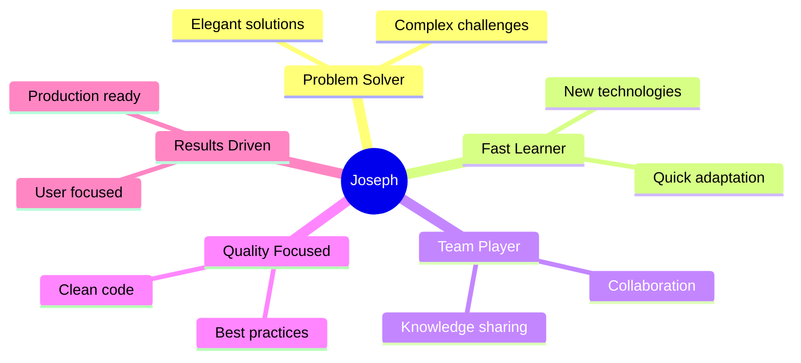

<div align="center">

# 👨‍💻 Joseph Landeo

### Software Engineer | Full Stack Developer | Data Enthusiast

<p>
  <a href="https://n9.cl/linkedin-josephlandeo">
    
  </a>
  <a href="mailto:joslan2906@gmail.com">
    
  </a>
  <a href="https://github.com/landeo29">
    
  </a>
  <a href="https://github.com/landeo29">
    
  </a>
</p>


</div>

---

## 🚀 About Me

Backend & Frontend specialist with strong focus on **scalable systems**, **RESTful APIs**, **data analytics**, and **end-to-end solutions**. Passionate about clean architecture, microservices, and leveraging technology to solve real-world problems.
```typescript
const joseph = {
    location: "🌎 Lima, Peru",
    currentRole: "Full Stack Developer @ FOGAPI",
    experience: "3+ years",
    currentFocus: ["Scalable Backend Systems", "Interactive Dashboards", "Data Engineering"],
    specialties: ["API Development", "Database Optimization", "Clean Architecture"],
    learning: ["Data Engineering", "Cloud Certifications", "Machine Learning"],
    funFact: "I love combining software engineering with data analytics! 📊"
};
```

---

## 🛠️ Tech Stack

### 💻 Backend Development

<p>
  
  
  
  
  
  
  
  
  
</p>

### 🎨 Frontend Development

<p>
  
  
  
  
  
  
  
</p>

### 🗄️ Databases & Data

<p>
  
  
  
  
  
  
  
</p>

### ☁️ Cloud & DevOps

<p>
  
  
  
  
  
  
  
</p>

### 📊 Data Science & ML

<p>
  
  
  
  
  
  
</p>

---

## 💼 What I Do Best

<table>
<tr>
<td width="50%" valign="top">

### 🏗️ Backend Engineering
- 🚀 RESTful API design & implementation
- 🔄 Microservices architecture
- ⚡ Database optimization & query tuning
- 🔐 Authentication & Authorization (JWT, OAuth)
- 🔗 Third-party integrations
- 📦 Clean Architecture & SOLID principles

### 📊 Data & Analytics
- 🤖 Predictive modeling with ML
- 🔄 ETL pipelines & data processing
- 📈 Business intelligence dashboards
- 🎯 SQL optimization & performance
- 📊 Real-time data visualization
- ⏱️ Time series data analysis

</td>
<td width="50%" valign="top">

### 💻 Full Stack Development
- 🎨 End-to-end solutions
- 📱 Responsive UI/UX
- 📊 Interactive dashboards
- ⚡ Performance optimization
- 🔄 State management (Redux, Context API)
- 🧪 Testing (Unit, Integration, E2E)

### 👥 Leadership & Best Practices
- 🎯 Team leadership & mentoring
- 📋 Agile/Scrum methodologies
- ✨ Clean code & design patterns
- 👀 Code review & quality assurance
- 📚 Technical documentation
- 🔒 Security best practices (OWASP)

</td>
</tr>
</table>

---

## 🎯 Key Achievements

<div align="center">

| 🚀 Performance | 🏗️ Architecture | 🔐 Security | ☁️ Cloud |
|:---:|:---:|:---:|:---:|
| **40%+ faster queries** | **Clean Architecture** | **OWASP compliance** | **AWS & Azure** |
| Database optimization | Microservices design | Security audits | Cloud deployments |
| **1000s of requests/min** | **Multi-tenancy** | **Vulnerability fixes** | **CI/CD pipelines** |
| Production APIs | Scalable systems | ZAP security testing | Automated testing |

</div>

---

## 📈 Featured Projects

<div align="center">

| Project | Tech Stack | Highlights |
|---------|-----------|------------|
| 🏢 **Funcional Neuro Laboral** | FastAPI, React, PostgreSQL | Multi-tenant stress assessment platform |
| 💧 **Water Treatment Analytics** | .NET, TimescaleDB, React | Time series data analysis system |
| 💳 **NPS Survey System** | .NET 8, Oracle, PostgreSQL | Enterprise feedback platform |
| 🤖 **ML Stress Predictor** | Python, Scikit-learn | Ridge Regression with 95%+ accuracy |

</div>

---

## 🌟 Core Values

<div align="center">


</div>

---

## 📫 Let's Connect!

<div align="center">

<table>
<tr>
<td align="center" width="33%">

### 📧 Email
[joslan2906@gmail.com](mailto:joslan2906@gmail.com)

</td>
<td align="center" width="33%">

### 💼 LinkedIn
[Joseph Landeo](https://n9.cl/linkedin-josephlandeo)

</td>
<td align="center" width="33%">

### 📍 Location
Lima, Peru 🇵🇪

</td>
</tr>
</table>

[](mailto:joslan2906@gmail.com)
[](https://n9.cl/linkedin-josephlandeo)
[](https://github.com/landeo29)

</div>

---

## 📊 GitHub Stats

<div align="center">


</div>

<div align="center">


</div>

---

## 🏆 GitHub Trophies

<div align="center">

[](https://github.com/ryo-ma/github-profile-trophy)

</div>

---

## 📚 Latest Blog Posts & Learning

<div align="center">

<!-- BLOG-POST-LIST:START -->
- 🔄 Currently learning: **Data Engineering with DataCamp**
- 📖 Reading: **Clean Architecture** by Robert C. Martin
- 🎯 Next goal: **AWS Solutions Architect Certification**
<!-- BLOG-POST-LIST:END -->

</div>

---

<div align="center">

### 💡 *"Code is poetry written in logic"*


**⭐ If you like what you see, consider starring some repositories! ⭐**

</div>
