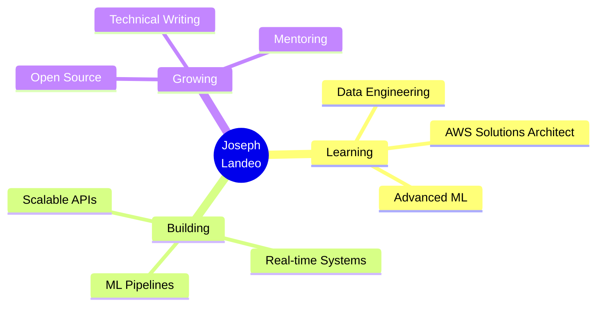

<div align="center">


</div>

<div align="center">
  
<!-- Animated typing effect with gradient -->


</div>

<!-- Social badges with hover effect -->
<p align="center">
  <a href="https://n9.cl/linkedin-josephlandeo">
    
  </a>
  <a href="mailto:joslan2906@gmail.com">
    
  </a>
  <a href="https://github.com/landeo29">
    
  </a>
  <a href="#">
    
  </a>
  <a href="#">
    
  </a>
</p>

<div align="center">
  
  
  
</div>

<br>

<!-- Aesthetic divider -->


<br>

##  About Me


```javascript
const joseph = {
  pronouns: "He" | "Him",
  location: "🌎 Lima, Peru",
  currentRole: "Full Stack Developer @ FOGAPI",
  experience: "3+ Years",
  
  workingOn: {
    backend: ["RESTful APIs", "Microservices"],
    frontend: ["React Dashboards", "Real-time Apps"],
    data: ["ML Models", "Data Pipelines"]
  },
  
  learning: [
    "Data Engineering 📊",
    "Cloud Architecture ☁️",
    "Machine Learning 🤖"
  ],
  
  architecture: ["Microservices", "Event-Driven", "Clean Architecture"],
  
  challenge: "Building scalable systems that make impact 🚀",
  
  funFact: "I turn coffee ☕ into code 💻"
};
```

<br>


<br>

##  Tech Arsenal

### 🎯 Core Languages

<p align="center">
  
</p>

### 💻 Backend Technologies

<p align="center">
  
</p>

### 🎨 Frontend Frameworks

<p align="center">
  
</p>

### 🗄️ Databases & Storage

<p align="center">
  
</p>

### ☁️ Cloud & DevOps

<p align="center">
  
</p>

### 🛠️ Tools & Platforms

<p align="center">
  
</p>

### 📊 Data Science & ML

<p align="center">
  
  
  
  
</p>

<br>


<br>

## 💼 What I Bring to the Table

<table align="center">
<tr>
<td align="center" width="50%">

### 🏗️ Backend Mastery
```yaml
✨ RESTful API Design
⚡ Microservices Architecture  
🔐 Authentication & Security
📦 Clean Architecture
🔄 Event-Driven Systems
💾 Database Optimization
```

</td>
<td align="center" width="50%">

### 🎨 Frontend Excellence
```yaml
⚛️ Modern React & Angular
🎯 State Management
📱 Responsive Design
⚡ Performance Optimization
🧪 Testing & Quality
💅 UI/UX Implementation
```

</td>
</tr>

<tr>
<td align="center" width="50%">

### 📊 Data Engineering
```yaml
🤖 ML Model Development
📈 Predictive Analytics
🔄 ETL Pipelines
⏱️ Time Series Analysis
📊 Real-time Dashboards
💡 Business Intelligence
```

</td>
<td align="center" width="50%">

### 👨‍💼 Leadership & Practices
```yaml
🎯 Agile/Scrum Master
👥 Team Mentoring
📝 Technical Documentation
✅ Code Review & QA
🔒 Security Best Practices
🚀 CI/CD Implementation
```

</td>
</tr>
</table>

<br>


<br>

## 🚀 Featured Projects

<div align="center">

<table>
<tr>
<td width="50%">

### 🏢 Funcional Neuro Laboral
**Multi-tenant Stress Assessment Platform**


🎯 **Key Features:**
- Multi-company stress tracking
- Real-time analytics dashboard
- Clean Architecture + DDD
- Advanced reporting system

</td>
<td width="50%">

### 💧 Water Treatment Analytics
**Time Series Data Analysis System**


🎯 **Key Features:**
- Historical data visualization
- Real-time monitoring
- Predictive maintenance
- Performance optimization

</td>
</tr>

<tr>
<td width="50%">

### 💳 Enterprise NPS System
**Customer Satisfaction Platform**


🎯 **Key Features:**
- Multi-database architecture
- Automated surveys
- Analytics & insights
- Enterprise integration

</td>
<td width="50%">

### 🤖 ML Stress Predictor
**Predictive Analytics Engine**


🎯 **Key Features:**
- 95%+ prediction accuracy
- Ridge Regression model
- API-first architecture
- Real-time predictions

</td>
</tr>
</table>

</div>

<br>


<br>

## 🏆 Key Achievements

<div align="center">

| 🎯 Metric | 💎 Achievement | 📈 Impact |
|:---:|:---:|:---:|
| ⚡ **Performance** | 40%+ Query Optimization | Database efficiency boost |
| 🏗️ **Architecture** | Clean Architecture | Maintainable codebase |
| 🔐 **Security** | OWASP Compliance | Vulnerability prevention |
| 📊 **Scale** | 1000s req/min | Production-grade APIs |
| ☁️ **Cloud** | Multi-cloud Deploy | AWS + Azure infrastructure |
| 🧪 **Quality** | 85%+ Test Coverage | Reliable deployments |

</div>

<br>


<br>

## 📊 GitHub Analytics

<div align="center">


</div>

<div align="center">


</div>

<br>

<div align="center">


</div>

<br>


<br>

## 🎯 Current Focus

<div align="center">


</div>

<br>

<table align="center">
<tr>
<td align="center" width="33%">
  
### 📚 Currently Learning


Data Engineering Track

</td>
<td align="center" width="33%">

### 📖 Reading Now


Clean Architecture

</td>
<td align="center" width="33%">

### 🎯 Next Goal


Solutions Architect

</td>
</tr>
</table>

<br>


<br>

## 🌟 Core Values & Principles

<div align="center">

<table>
<tr>
<td align="center" width="20%">


### Problem Solver
*Elegant solutions to complex challenges*

</td>
<td align="center" width="20%">


### Fast Learner
*Quick adaptation to new technologies*

</td>
<td align="center" width="20%">


### Team Player
*Collaboration & knowledge sharing*

</td>
<td align="center" width="20%">


### Quality Focused
*Clean, maintainable code*

</td>
<td align="center" width="20%">


### Results Driven
*Production-ready delivery*

</td>
</tr>
</table>

</div>

<br>


<br>

## 💬 Let's Connect!

<div align="center">


### I'm always open to interesting conversations and collaboration!

<br>

<table>
<tr>
<td align="center" width="25%">


**Email**

[joslan2906@gmail.com](mailto:joslan2906@gmail.com)

</td>
<td align="center" width="25%">


**LinkedIn**

[Joseph Landeo](https://n9.cl/linkedin-josephlandeo)

</td>
<td align="center" width="25%">


**Location**

Lima, Peru 🇵🇪

</td>
<td align="center" width="25%">


**GitHub**

[@landeo29](https://github.com/landeo29)

</td>
</tr>
</table>

<br>

<a href="mailto:joslan2906@gmail.com">
  
</a>
<a href="https://n9.cl/linkedin-josephlandeo">
  
</a>
<a href="https://github.com/landeo29">
  
</a>

</div>

<br>


<br>

## 💭 Random Dev Quote

<div align="center">


</div>

<br>

<div align="center">

### 💡 *"First, solve the problem. Then, write the code."*
*– John Johnson*

<br>

 **Thanks for visiting!** 

<br>

**If you find my work interesting, consider:**

⭐ Starring repositories | 👀 Following me | 💬 Reaching out

</div>

<br>


